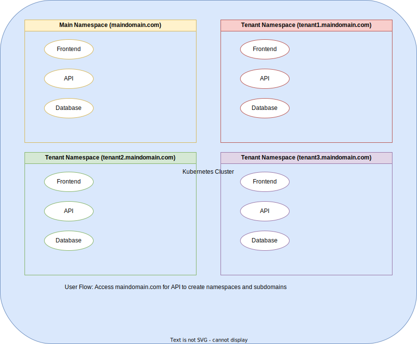

# FastAPI Multi-Tenant API

This repository contains a FastAPI application with multi-tenant support, deployed using Kubernetes.

## Kubernetes Multi-Tenancy Diagram


## Prerequisites

- Docker
- Kubernetes (Minikube or any other Kubernetes cluster)
- kubectl
- Python 3.10 or later
- ingress

## Setup

### 1. Clone the Repository

```sh
git clone <repository-url>
cd <repository-directory>
```

### Set up Kubernetes tools on your computer.
https://kubernetes.io/docs/tasks/tools/


### Install minikube
https://minikube.sigs.k8s.io/docs/start/?arch=%2Fmacos%2Farm64%2Fstable%2Fhomebrew


### Install ingress
```sh
minikube addons enable ingress
```

### Create namespace by command
```sh
kubectl create namespace tenant1
```

### Delete namespace
```sh
kubectl delete namespace tenant1
```

### Apply the Kubernetes Resources
Apply the deployment, service, and ingress configurations to your Kubernetes cluster:
```sh
kubectl apply -f frontend-deployment.yaml --namespace=tenant1
kubectl apply -f frontend-service.yaml --namespace=tenant1


kubectl apply -f backend-deployment.yaml --namespace=tenant1
kubectl apply -f backend-service.yaml --namespace=tenant1


kubectl apply -f ingress.yaml --namespace=tenant1
```


### Wait for ingress address
```sh
kubectl get ingress -n tenant1
```


### For Development Run API
```sh
sudo vi /etc/hosts
127.0.0.1 central.local tenant1.central.local api.tenant1.central.local

fastapi dev main.py

Or run on port 80
sudo fastapi dev --host central.local --port 80
```

### Update /etc/hosts File
Add an entry to your /etc/hosts file to map tenant1.localhost.local to the Minikube IP address. First, get the Minikube IP address:
```sh
minikube start
minikube ip
```

Then, add the following entry to your /etc/hosts file:
```sh
sudo vi /etc/hosts
```

Add the following line, replacing <minikube-ip> with the actual IP address:
```sh
<minikube-ip> tenant1.localhost.local
```

### Verify the Deployment
Check the status of the deployment to ensure that the pods are running correctly:
```sh
kubectl get deployment frontend -n tenant1
kubectl get pods -n tenant1 -l app=frontend

kubectl get all -n tenant1
```


```sh

kubectl get pods -n tenant1 -l app=frontend  

kubectl describe pod -n tenant1 -l app=frontend

kubectl delete pod -n tenant1 -l app=frontend


kubectl rollout restart deployment/frontend -n tenant1
```

### Fallback Solution: Port Forwarding

```sh
kubectl port-forward service/frontend 8080:80 -n tenant1

kubectl port-forward service/backend 8081:80 -n tenant1
```

### Access the Frontend Application
Open your browser and navigate to http://tenant1.central.local:8080 to see your frontend application running.
Open your browser and navigate to http://api.tenant1.central.local:8081 to see your frontend application running.


## BUILD DOCKER LOCAL


### Step 1: Build the Image Locally
Build the fastapi-backend image on your local Docker environment:
```sh
docker build -t fastapi-backend .
```


### Step 2: Load the Image into Minikube
Now, use Minikube’s image load command to make the local image available to Minikube:


```sh
minikube image load fastapi-backend
```


### Step 3: Verify that the image is present in your local Docker registry:

```sh
minikube ssh
docker images | grep fastapi-backend
```


